# Database Architecture

> Official database reference for the Messenger project.
> Written for developers who know Laravel basics but may be new to database design.
> Source of truth: migrations, Eloquent models, enums, factories, and seeders.
> Last aligned with schema as of July 2026.

---

## Table of Contents

1. [Database Overview](#database-overview)
2. [Beginner Concepts](#beginner-concepts)
3. [Entity Relationship Diagram](#entity-relationship-diagram)
4. [Tables](#tables)
5. [Database Relationships](#database-relationships)
6. [Complete Data Flows](#complete-data-flows)
7. [Every Foreign Key](#every-foreign-key)
8. [Every Index](#every-index)
9. [Business Rules](#business-rules)
10. [Database Lifecycle](#database-lifecycle)
11. [Laravel Models and Eloquent](#laravel-models-and-eloquent)
12. [Sample Records](#sample-records)
13. [Enums Reference](#enums-reference)

---

# Database Overview

## What kind of application is this?

This is a **real-time messenger** built with Laravel. Users can:

- Chat one-on-one (private conversations)
- Chat in groups
- Publish to channels (schema supports this; demo seeders currently create private + group only)
- Send text and media messages
- React with emoji, pin important messages, and see delivery/read receipts
- Stay online across multiple devices with presence and typing indicators
- Block other users
- Sign in with password, two-factor authentication, and passkeys

The database is the shared memory of the whole product. Every chat, membership, file, and receipt lives in a table.

## Why each table exists (quick map)

| Table | Why it exists |
| ----- | ------------- |
| `users` | Who can log in and chat |
| `password_reset_tokens` | Temporary tokens for password reset emails |
| `sessions` | Laravel web session store (browser cookies) |
| `cache` / `cache_locks` | Laravel cache driver when using the database |
| `jobs` / `job_batches` / `failed_jobs` | Background queue work |
| `passkeys` | WebAuthn / passkey credentials per user |
| `conversations` | A chat thread (private, group, or channel) |
| `conversation_members` | Who belongs to a chat, their role, mute/archive, read cursor |
| `messages` | Every message body and metadata |
| `attachments` | Files linked to messages (images, videos, docs, etc.) |
| `message_deliveries` | Per-user "delivered" receipts |
| `message_reads` | Per-user "read" receipts |
| `message_reactions` | Emoji reactions on messages |
| `message_pins` | Messages pinned inside a conversation |
| `devices` | Phones, browsers, and desktops a user logs in from |
| `device_sessions` | Hashed auth tokens for those devices |
| `user_presences` | Online / offline / away / busy (one row per user) |
| `typing_statuses` | Who is currently typing in which chat |
| `blocked_users` | Who blocked whom |

## How data flows through the application

Think of the database as layers:

1. **Identity** — `users`, passkeys, 2FA columns, devices, device sessions
2. **Social graph** — conversations + membership + blocks
3. **Content** — messages + attachments
4. **Engagement** — deliveries, reads, reactions, pins
5. **Realtime state** — presence + typing (short-lived)

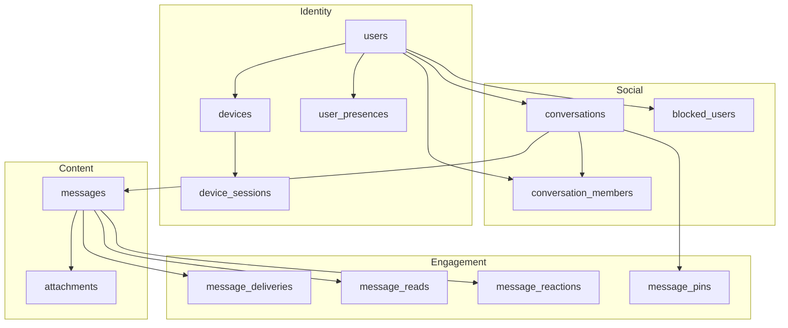

## What happens when a user sends a message

1. The sender must already be a **member** of the conversation (`conversation_members`, and ideally `left_at` is null).
2. A row is inserted into `messages` (with `uuid`, `conversation_id`, `sender_id`, `body`, `message_type`, `sent_at`).
3. If the message is media, one or more rows go into `attachments`.
4. Application code should update `conversations.last_message_id` to the new message (denormalized pointer for inbox lists). There is **no Observer yet** that does this automatically — seeders do set it.
5. Recipients later get rows in `message_deliveries`, then `message_reads`.
6. Members may move their `last_read_message_id` cursor forward as they catch up.

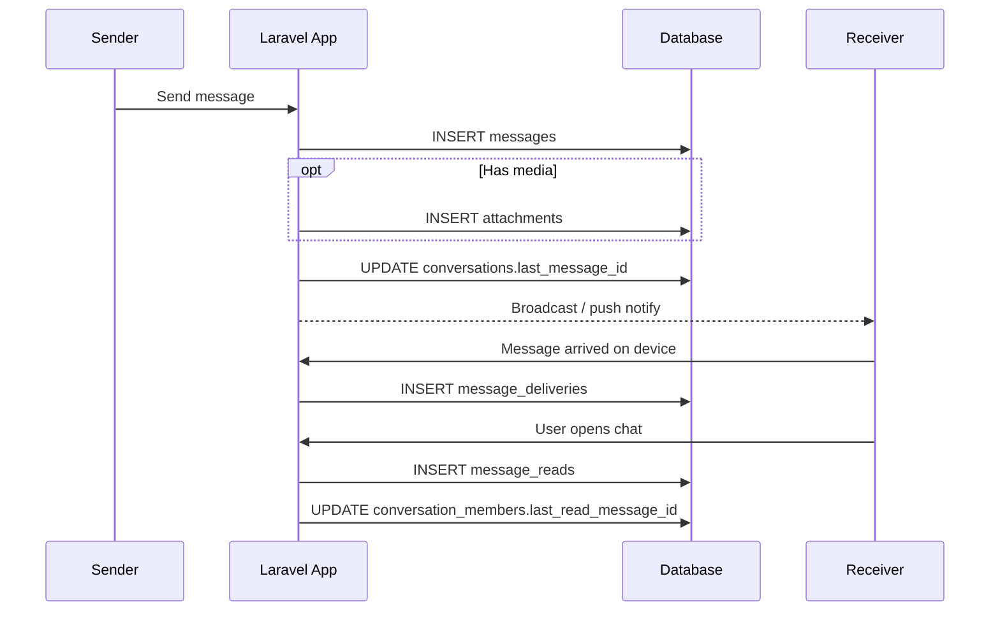

## What happens when someone creates a group

1. Insert `conversations` with `type = 2` (group), `created_by`, and a `name`.
2. Insert the creator into `conversation_members` with `role = 'owner'`.
3. Insert each invited user into `conversation_members` (often `member`, sometimes `admin` / `moderator`).
4. Optionally insert a system message into `messages` (`message_type = 6`).

## What happens when someone joins a conversation

1. Insert (or re-activate) a `conversation_members` row for `(conversation_id, user_id)`.
2. The unique constraint on `(conversation_id, user_id)` means the same user cannot have two membership rows for the same chat.
3. If they previously left, you typically clear `left_at` rather than inserting a duplicate (application logic — the schema only stores one row per pair).

## How messages are retrieved

Typical inbox / thread queries:

- List chats for a user: join `conversation_members` → `conversations`, often ordered by `last_message_id` or the related message `sent_at`.
- Load a thread: `messages` filtered by `conversation_id`, ordered by `id` or `sent_at`, excluding soft-deleted rows by default (`deleted_at IS NULL` via Eloquent SoftDeletes).
- Public API routes use `conversations.uuid` and `messages.uuid` as stable external IDs.

## How unread messages are tracked

This project uses **two layers** (by design):

| Layer | Where | What it answers |
| ----- | ----- | --------------- |
| Cursor | `conversation_members.last_read_message_id` | "How far has this member read in this chat?" — fast unread counts |
| Per-message receipts | `message_reads` | "Exactly which messages did this user mark as read?" — detailed receipts |

Seeders treat read as implying delivered: a `message_reads` row is only created when a matching `message_deliveries` row already exists.

## How reactions work

- One row in `message_reactions` per `(message_id, user_id, emoji)`.
- The same user can add different emojis, but not the same emoji twice on the same message (unique constraint).

## How attachments work

- Attachments always belong to a message (`message_id` required, cascade delete).
- `storage` says where the file lives (`local`, `s3`, `minio`).
- `path` is the storage key; `mime_type`, `size`, and optional `width` / `height` / `duration` / `checksum` describe the file.
- Message types that typically have attachments: image, video, audio, file, voice note, gif (`MessageType::hasAttachment()`).

## Important design notes

- Soft deletes exist **only** on `messages`.
- `conversations.created_by` uses **restrict** on delete — you cannot hard-delete a user who still created conversations.
- There are currently **no** messaging observers, services, or repositories. Behavior described below comes from schema + Eloquent + seeders.

---

# Beginner Concepts

These ideas appear throughout the schema. Each is defined once here.

## Foreign key

A **foreign key** is a column that points to the primary key of another table. Example: `messages.sender_id` points to `users.id`. It keeps data honest — you cannot assign a sender that does not exist.

## Cascade / restrict / null on delete

When the parent row is deleted:

| Rule | Meaning in this project |
| ---- | ----------------------- |
| `cascadeOnDelete` | Child rows are deleted automatically (e.g. messages when a conversation is deleted) |
| `restrictOnDelete` | Delete is blocked if children exist (e.g. user who created conversations) |
| `nullOnDelete` | Child FK is set to `NULL` (e.g. `last_message_id` if that message disappears) |

## Index

An **index** is a lookup structure the database builds so queries do not scan every row. Unique indexes also prevent duplicates (e.g. `users.email`).

## Soft delete

A **soft delete** sets `deleted_at` instead of removing the row. Eloquent hides soft-deleted messages by default. Only `messages` uses this.

## Pivot-like membership

`conversation_members` is not a pure Laravel `belongsToMany` pivot with only two IDs. It is a full model with role, mute, archive, and read cursor — a **membership entity**.

## Denormalized `last_message_id`

Instead of always computing `MAX(messages.id)` per conversation, the conversation stores a pointer. Faster inbox lists; must be kept in sync by application code.

## Composite primary key

`message_reads` and `message_deliveries` use `(message_id, user_id)` as the primary key — no auto-increment `id`. Eloquent can insert/query them, but `find()` / updates need care.

## UUID vs numeric id

Internal `id` is a big integer primary key (fast joins). Public `uuid` on conversations/messages/devices is a stable string for URLs and clients.

---

# Entity Relationship Diagram

Messenger and auth domain (framework cache/queue/session tables omitted for clarity):

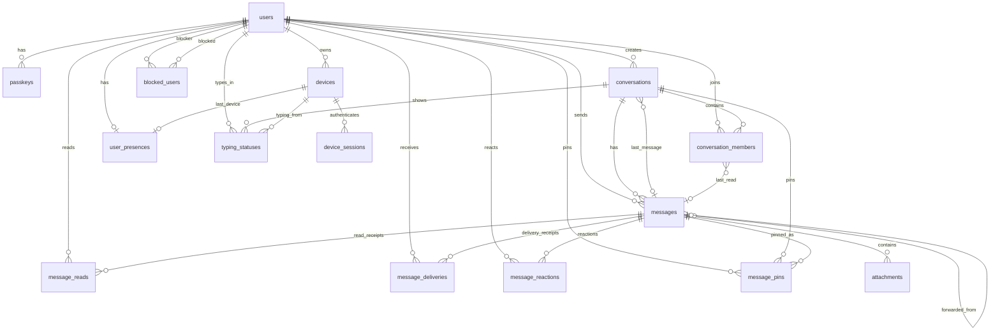

Laravel infrastructure tables (separate concern):

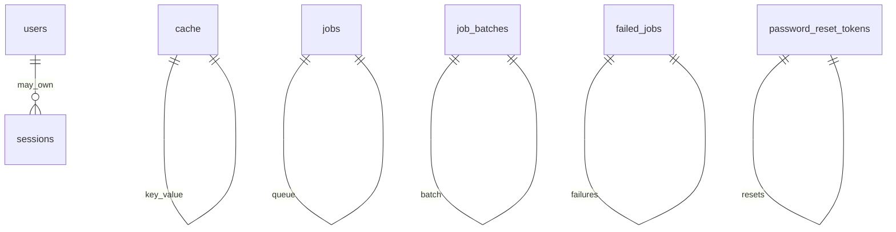

---

# Tables

# Table: users

## Purpose

The `users` table stores every person who can authenticate and use the messenger. Without users there is no sender, no member, no blocker, and no device owner. It is the root of the identity layer.

## Stores

* Display name
* Login email (unique)
* Hashed password
* Email verification timestamp
* Remember-me token
* Two-factor authentication secret, recovery codes, and confirmation time
* Created / updated timestamps

## Column-by-Column Explanation

| Column | Type | Meaning | Example | Required | Notes |
| ------ | ---- | ------- | ------- | -------- | ----- |
| `id` | bigint unsigned PK | Internal user id | `1` | Yes | Auto-increment |
| `name` | string | Display name | `Muhammad` | Yes | Shown in chats |
| `email` | string | Login email | `muhammad@example.com` | Yes | Unique index |
| `email_verified_at` | timestamp nullable | When email was verified | `2026-01-10 09:00:00` | No | Null = unverified |
| `password` | string | Password hash | `$2y$...` | Yes | Cast to `hashed` in Eloquent |
| `two_factor_secret` | text nullable | TOTP secret | encrypted blob | No | Fortify 2FA |
| `two_factor_recovery_codes` | text nullable | Backup codes | encrypted JSON | No | Fortify 2FA |
| `two_factor_confirmed_at` | timestamp nullable | When 2FA was confirmed | `2026-02-01 12:00:00` | No | Null = 2FA not active |
| `remember_token` | string(100) nullable | Remember-me cookie token | random string | No | Laravel auth |
| `created_at` | timestamp nullable | Row created | `2026-01-01 08:00:00` | No | Laravel timestamps |
| `updated_at` | timestamp nullable | Row last updated | `2026-07-01 10:00:00` | No | Laravel timestamps |

## Relationships

A User:

* `hasMany` **ConversationMember** via `memberships()` — every chat they joined
* `hasMany` **Message** via `sentMessages()` (`sender_id`) — every message they sent
* `hasMany` **Conversation** via `createdConversations()` (`created_by`) — chats they created
* `hasMany` **Device** — phones/browsers
* `hasOne` **UserPresence** — online status
* `hasMany` **TypingStatus** — typing indicators
* `hasMany` **MessageRead** / **MessageDelivery** / **MessageReaction**
* `hasMany` **BlockedUser** as blocker (`blockedUsers`) and as blocked (`blockedBy`)
* Passkeys via Fortify `PasskeyAuthenticatable`

**Why:** almost every messenger table eventually points back to a user. Membership answers "which chats"; `sender_id` answers "who wrote this".

> Note: `User::conversations()` is deprecated and currently returns memberships, not Conversation models.

## Real Example

Muhammad registers → row in `users` (`id = 1`).
He creates a private chat with Ali → `conversations` + two `conversation_members`.
He sends "Salam" → `messages` with `sender_id = 1`.
Ali reacts with thumbs-up → `message_reactions` with Ali's `user_id`.

## Insert Flow

1. User registers → insert `users`
2. Optional: enable 2FA → update 2FA columns
3. Optional: register passkey → insert `passkeys`
4. Login from a phone → insert `devices` (later `device_sessions`, `user_presences`)

## Query Examples

```sql
-- Find user by email
SELECT * FROM users WHERE email = 'muhammad@example.com';

-- All conversation ids for a user
SELECT conversation_id
FROM conversation_members
WHERE user_id = 1 AND left_at IS NULL;
```

Why it works: membership is the join between users and conversations.

## Common Mistakes

* Hard-deleting a user who still has `conversations.created_by` pointing at them (restricted).
* Assuming `conversations()` returns Conversation models.
* Storing plain-text passwords (Eloquent `hashed` cast prevents this when using the model).

## Best Practices

* Use soft-delete or anonymization strategies carefully given `restrictOnDelete` on `created_by`.
* Prefer `memberships()` for chat lists.
* Never expose `password` / 2FA fields in API resources (already `$hidden`).

---

# Table: passkeys

## Purpose

Stores WebAuthn / passkey credentials so a user can sign in without a password (Laravel Fortify passkeys).

## Stores

* Which user owns the credential
* Human-friendly name
* Credential id and JSON credential payload
* Last used time

## Column-by-Column Explanation

| Column | Type | Meaning | Example | Required | Notes |
| ------ | ---- | ------- | ------- | -------- | ----- |
| `id` | bigint unsigned PK | Row id | `10` | Yes | |
| `user_id` | bigint unsigned FK | Owner | `1` | Yes | Cascade delete with user |
| `name` | string | Label | `MacBook Touch ID` | Yes | |
| `credential_id` | string | Public credential id | base64 id | Yes | Unique |
| `credential` | json | Credential data | `{...}` | Yes | |
| `last_used_at` | timestamp nullable | Last successful use | `2026-07-12 11:00:00` | No | |
| `created_at` / `updated_at` | timestamp nullable | Audit | | No | |

## Relationships

`belongsTo` User (`user_id`). When the user is deleted, passkeys cascade away.

## Real Example

Muhammad adds Touch ID → one `passkeys` row for `user_id = 1` with a unique `credential_id`.

## Insert Flow

1. User completes WebAuthn registration
2. Insert `passkeys` linked to `users.id`

## Query Examples

```sql
SELECT * FROM passkeys WHERE user_id = 1;
```

## Common Mistakes

* Reusing `credential_id` across users (blocked by unique index).
* Deleting users expecting passkeys to remain (they cascade).

## Best Practices

* Treat `credential` as sensitive.
* Update `last_used_at` on successful authentication.

---

# Table: password_reset_tokens

## Purpose

Temporary storage for password-reset tokens emailed to users (Laravel default auth table).

## Stores

* Email address (primary key)
* Token string
* Creation time

## Column-by-Column Explanation

| Column | Type | Meaning | Example | Required | Notes |
| ------ | ---- | ------- | ------- | -------- | ----- |
| `email` | string PK | Account email | `ali@example.com` | Yes | One active token per email |
| `token` | string | Reset token (hashed by framework) | hash | Yes | |
| `created_at` | timestamp nullable | When issued | `2026-07-12 10:00:00` | No | Used for expiry |

## Relationships

No formal FK to `users`, but `email` should match a user email in practice.

## Real Example

Ali clicks "Forgot password" → row keyed by `ali@example.com`.

## Insert Flow

1. Request reset → upsert row for email
2. User resets password → token row removed

## Query Examples

```sql
SELECT * FROM password_reset_tokens WHERE email = 'ali@example.com';
```

## Common Mistakes

* Expecting a foreign key to `users` (there is none).
* Leaving expired tokens forever (framework cleans on use; apps may prune by `created_at`).

## Best Practices

* Rely on Laravel's password broker rather than manual inserts.
* Prune old tokens in maintenance jobs.

---

# Table: sessions

## Purpose

Laravel database session driver storage for browser HTTP sessions (not the same as `device_sessions`).

## Stores

* Session id, optional user id, IP, user agent, payload, last activity

## Column-by-Column Explanation

| Column | Type | Meaning | Example | Required | Notes |
| ------ | ---- | ------- | ------- | -------- | ----- |
| `id` | string PK | Session id | `abc123...` | Yes | |
| `user_id` | bigint unsigned nullable | Logged-in user | `1` | No | Indexed, **not** FK-constrained |
| `ip_address` | string(45) nullable | Client IP | `203.0.113.10` | No | |
| `user_agent` | text nullable | Browser UA | `Mozilla/...` | No | |
| `payload` | longText | Serialized session data | | Yes | |
| `last_activity` | integer | Unix timestamp | `1720000000` | Yes | Indexed |

## Relationships

Logical link to `users` via `user_id`, but no database foreign key.

## Real Example

Muhammad opens the web app → a `sessions` row; after login `user_id` is set.

## Insert Flow

Managed by Laravel session middleware when `SESSION_DRIVER=database`.

## Query Examples

```sql
SELECT id, user_id, last_activity FROM sessions WHERE user_id = 1;
```

## Common Mistakes

* Confusing this with `device_sessions` (API/device tokens).
* Assuming deleting a user cascades session rows (no FK).

## Best Practices

* Use for web cookies only; use `device_sessions` for messenger device auth.
* Index usage already covers `user_id` and `last_activity`.

---

# Table: cache

## Purpose

Key/value cache store when Laravel uses the database cache driver.

## Stores

* Cache key, serialized value, expiration unix time

## Column-by-Column Explanation

| Column | Type | Meaning | Example | Required | Notes |
| ------ | ---- | ------- | ------- | -------- | ----- |
| `key` | string PK | Cache key | `user:1:inbox` | Yes | |
| `value` | mediumText | Cached payload | serialized | Yes | |
| `expiration` | bigInteger | Expiry unix time | `1720003600` | Yes | Indexed |

## Relationships

None.

## Real Example

App caches unread counts under a key; row expires after `expiration`.

## Insert Flow

Laravel Cache facade writes/reads/deletes these rows automatically.

## Query Examples

```sql
SELECT `key` FROM cache WHERE expiration < UNIX_TIMESTAMP();
```

## Common Mistakes

* Treating cache as source of truth for unread state (it is ephemeral).

## Best Practices

* Prefer Redis for high traffic; database cache is fine for local/dev.

---

# Table: cache_locks

## Purpose

Distributed locks for the database cache lock driver (prevent two processes doing the same work).

## Stores

* Lock key, owner token, expiration

## Column-by-Column Explanation

| Column | Type | Meaning | Example | Required | Notes |
| ------ | ---- | ------- | ------- | -------- | ----- |
| `key` | string PK | Lock name | `send-message:55` | Yes | |
| `owner` | string | Lock owner token | random | Yes | |
| `expiration` | bigInteger | Expiry | unix time | Yes | Indexed |

## Relationships

None.

## Real Example

A job acquires `key = rebuild-inbox:1` while rebuilding unread counts.

## Insert Flow

Laravel Cache locks insert/update/delete rows.

## Query Examples

```sql
SELECT * FROM cache_locks WHERE `key` = 'rebuild-inbox:1';
```

## Common Mistakes

* Manually deleting locks while a process still holds them.

## Best Practices

* Keep lock TTLs short; let the framework manage ownership.

---

# Table: jobs

## Purpose

Queued jobs waiting to run when `QUEUE_CONNECTION=database`.

## Stores

* Queue name, payload, attempts, availability timestamps

## Column-by-Column Explanation

| Column | Type | Meaning | Example | Required | Notes |
| ------ | ---- | ------- | ------- | -------- | ----- |
| `id` | bigint unsigned PK | Job id | `100` | Yes | |
| `queue` | string | Queue name | `default` | Yes | Indexed |
| `payload` | longText | Serialized job | JSON | Yes | |
| `attempts` | unsignedSmallInteger | Tries so far | `0` | Yes | |
| `reserved_at` | unsignedInteger nullable | When worker reserved it | unix | No | |
| `available_at` | unsignedInteger | When it may run | unix | Yes | |
| `created_at` | unsignedInteger | Created | unix | Yes | Not Laravel `timestamps()` |

## Relationships

None to messenger tables.

## Real Example

"Send push notification for message 500" sits in `jobs` until a worker pops it.

## Insert Flow

`dispatch(new SomeJob)` → insert `jobs`.

## Query Examples

```sql
SELECT id, queue, attempts FROM jobs WHERE queue = 'default' LIMIT 20;
```

## Common Mistakes

* Expecting `created_at` to be a datetime column (it is an integer unix time).

## Best Practices

* Move to Redis/SQS in production if volume grows.
* Monitor `failed_jobs` for poison messages.

---

# Table: job_batches

## Purpose

Tracks batches of related jobs (`Bus::batch([...])`).

## Stores

* Batch id, name, totals, failure lists, options, cancel/finish times

## Column-by-Column Explanation

| Column | Type | Meaning | Example | Required | Notes |
| ------ | ---- | ------- | ------- | -------- | ----- |
| `id` | string PK | Batch uuid | `batch-...` | Yes | |
| `name` | string | Label | `fanout-push` | Yes | |
| `total_jobs` | integer | Total | `50` | Yes | |
| `pending_jobs` | integer | Still pending | `12` | Yes | |
| `failed_jobs` | integer | Failed count | `1` | Yes | |
| `failed_job_ids` | longText | Failed ids | JSON list | Yes | |
| `options` | mediumText nullable | Batch options | JSON | No | |
| `cancelled_at` | integer nullable | Cancel time | unix | No | |
| `created_at` | integer | Created | unix | Yes | |
| `finished_at` | integer nullable | Finished | unix | No | |

## Relationships

None.

## Real Example

Fan-out push notifications for a large group as one batch.

## Insert Flow

`Bus::batch([...])->dispatch()` creates the batch row and related jobs.

## Query Examples

```sql
SELECT id, name, pending_jobs, failed_jobs FROM job_batches WHERE finished_at IS NULL;
```

## Common Mistakes

* Deleting batch rows while jobs still reference the batch id in payloads.

## Best Practices

* Use batches for multi-step fan-out that needs progress tracking.

---

# Table: failed_jobs

## Purpose

Stores jobs that exhausted retries so developers can inspect and retry.

## Stores

* UUID, connection, queue, payload, exception, failed_at

## Column-by-Column Explanation

| Column | Type | Meaning | Example | Required | Notes |
| ------ | ---- | ------- | ------- | -------- | ----- |
| `id` | bigint unsigned PK | Row id | `5` | Yes | |
| `uuid` | string | Unique failure id | uuid | Yes | Unique |
| `connection` | string | Queue connection | `database` | Yes | |
| `queue` | string | Queue name | `default` | Yes | |
| `payload` | longText | Job payload | | Yes | |
| `exception` | longText | Stack trace | | Yes | |
| `failed_at` | timestamp | When failed | now | Yes | `useCurrent()` |

Composite index: `(connection, queue, failed_at)`.

## Relationships

None.

## Real Example

Push job fails because of invalid token → row in `failed_jobs` with exception text.

## Insert Flow

Queue worker moves exhausted jobs here.

## Query Examples

```sql
SELECT uuid, queue, failed_at FROM failed_jobs ORDER BY failed_at DESC LIMIT 20;
```

## Common Mistakes

* Ignoring failures; undelivered notifications accumulate silently.

## Best Practices

* Alert on growth; use `php artisan queue:retry`.


---

# Table: conversations

## Purpose

A conversation is one chat thread: a private DM, a group, or a channel. Every message belongs to exactly one conversation. Without this table, there is nowhere to hang membership or messages.

## Stores

* Public UUID for API routes
* Type (private / group / channel)
* Who created it
* Optional display name
* Pointer to the latest message (`last_message_id`)
* Timestamps

## Column-by-Column Explanation

| Column | Type | Meaning | Example | Required | Notes |
| ------ | ---- | ------- | ------- | -------- | ----- |
| `id` | bigint unsigned PK | Internal id | `10` | Yes | Used in FKs |
| `uuid` | uuid | Public id | `9c1e...` | Yes | Unique; route key |
| `type` | unsignedTinyInteger | Conversation kind | `1` private, `2` group, `3` channel | Yes | Cast to `ConversationType` |
| `created_by` | bigint unsigned FK | Creator user id | `1` | Yes | `restrictOnDelete` |
| `name` | string nullable | Title | `Weekend Plans` | No | Null for most private chats |
| `last_message_id` | unsignedBigInteger nullable FK | Latest message pointer | `500` | No | `nullOnDelete`; denormalized |
| `created_at` / `updated_at` | timestamp nullable | Audit | | No | |

Indexes: unique `uuid`; `type`; `created_by`; `last_message_id`.

## Relationships

* `belongsTo` User as `creator()` (`created_by`)
* `hasMany` ConversationMember as `members()`
* `hasMany` Message as `messages()`
* `belongsTo` Message as `lastMessage()` (`last_message_id`)
* `hasMany` TypingStatus as `typingStatuses()`
* `hasMany` MessagePin as `pins()`

**Why:** conversation is the hub. Members define access; messages are content; last message powers inbox sorting.

## Real Example

Muhammad creates a group "Family":

1. `conversations`: `type=2`, `created_by=1`, `name='Family'`
2. Members: Muhammad owner, Ali + Sara members
3. First system or welcome message updates `last_message_id`

## Insert Flow

1. Insert `conversations`
2. Insert creator + invitees into `conversation_members`
3. Optionally insert system `messages` and set `last_message_id`

## Query Examples

```sql
-- Inbox rows for user 1
SELECT c.id, c.uuid, c.name, c.type, c.last_message_id
FROM conversations c
JOIN conversation_members cm ON cm.conversation_id = c.id
WHERE cm.user_id = 1 AND cm.left_at IS NULL
ORDER BY c.last_message_id DESC;

-- Resolve by public uuid
SELECT * FROM conversations WHERE uuid = '9c1e...';
```

## Common Mistakes

* Forgetting to update `last_message_id` after send (inbox looks stale).
* Giving private chats a required name (schema allows null).
* Deleting the creator user while conversations still reference them (restricted).

## Best Practices

* Always create membership rows in the same transaction as the conversation.
* Use `uuid` externally; keep numeric `id` for joins.
* Keep `last_message_id` updates atomic with message inserts (service/observer when added).

---

# Table: conversation_members

## Purpose

Membership answers: who is in this chat, what role they have, whether they muted/archived it, when they joined/left, and how far they have read. The app cannot authorize chat access without this table.

## Stores

* Conversation + user pair (unique)
* Role (`owner`, `admin`, `moderator`, `member`)
* Join / leave times
* Last-read message cursor
* Mute and archive flags

## Column-by-Column Explanation

| Column | Type | Meaning | Example | Required | Notes |
| ------ | ---- | ------- | ------- | -------- | ----- |
| `id` | bigint unsigned PK | Membership id | `30` | Yes | |
| `conversation_id` | bigint unsigned FK | Chat | `10` | Yes | Cascade with conversation |
| `user_id` | bigint unsigned FK | Member | `2` | Yes | Cascade with user |
| `role` | string(30) | Permission role | `owner` | Yes | Default `member`; cast `MemberRole` |
| `joined_at` | timestamp | When joined | now | Yes | Default current |
| `left_at` | timestamp nullable | When left | null | No | Null = still active |
| `last_read_message_id` | unsignedBigInteger nullable FK | Read cursor | `480` | No | `nullOnDelete` |
| `is_muted` | boolean | Notifications muted | `0` | Yes | Default false |
| `is_archived` | boolean | Hidden from main inbox | `0` | Yes | Default false |
| `created_at` / `updated_at` | timestamp nullable | Audit | | No | |

Unique: `(conversation_id, user_id)`.
Indexes: `role`; `joined_at`; `(user_id, is_archived)`; `(conversation_id, last_read_message_id)`.

## Relationships

* `belongsTo` Conversation
* `belongsTo` User
* `belongsTo` Message as `lastReadMessage()`

**Why:** this is the access-control and per-user chat settings record.

## Real Example

Private chat between Muhammad (`user_id=1`) and Ali (`user_id=2`):

| id | conversation_id | user_id | role | left_at | last_read_message_id |
| -- | --------------- | ------- | ---- | ------- | -------------------- |
| 1 | 10 | 1 | member | null | 500 |
| 2 | 10 | 2 | member | null | 498 |

Ali has two unread messages if ids 499 and 500 exist.

## Insert Flow

1. Conversation exists
2. Insert membership for each participant
3. As they read, update `last_read_message_id`

## Query Examples

```sql
-- Active members of a chat
SELECT u.name, cm.role
FROM conversation_members cm
JOIN users u ON u.id = cm.user_id
WHERE cm.conversation_id = 10 AND cm.left_at IS NULL;

-- Approximate unread count using cursor
SELECT COUNT(*) AS unread
FROM messages m
JOIN conversation_members cm
  ON cm.conversation_id = m.conversation_id AND cm.user_id = 2
WHERE m.conversation_id = 10
  AND m.deleted_at IS NULL
  AND m.id > COALESCE(cm.last_read_message_id, 0)
  AND m.sender_id <> 2;
```

## Common Mistakes

* Inserting a duplicate membership for the same user/chat (unique constraint fails).
* Using only `message_reads` OR only the cursor and forgetting the other layer.
* Treating left members as active (check `left_at`).

## Best Practices

* Scope "active" as `left_at IS NULL` (model has `active` scope).
* Private chats: exactly two members (enforced by app/seeders, not DB check).
* Groups: creator should be `owner`.

---

# Table: messages

## Purpose

Messages are the content of the messenger. Each row is one sent item (text, media, or system event). Soft deletes preserve history while hiding content from normal queries.

## Stores

* Public UUID
* Conversation and sender
* Optional parent / reply / forward links
* Body text and type
* JSON metadata
* Sent / edited / soft-deleted times

## Column-by-Column Explanation

| Column | Type | Meaning | Example | Required | Notes |
| ------ | ---- | ------- | ------- | -------- | ----- |
| `id` | bigint unsigned PK | Message id | `500` | Yes | |
| `uuid` | uuid | Public id | `a1b2...` | Yes | Unique; HasUuids |
| `conversation_id` | bigint unsigned FK | Chat | `10` | Yes | Cascade |
| `sender_id` | bigint unsigned FK | Author | `1` | Yes | Cascade |
| `parent_message_id` | bigint unsigned nullable FK | Thread parent | `490` | No | Self-FK; `nullOnDelete` |
| `reply_to_id` | bigint unsigned nullable FK | Direct reply target | `495` | No | Self-FK; `nullOnDelete` |
| `forwarded_from_id` | bigint unsigned nullable FK | Original forwarded message | `200` | No | Self-FK; `nullOnDelete` |
| `body` | longText nullable | Text content | `Salam` | No | FULLTEXT on MySQL/MariaDB/PgSQL |
| `message_type` | unsignedTinyInteger | Kind of message | `0` text | Yes | Default 0; cast `MessageType` |
| `metadata` | json nullable | Extra structured data | `{"w":800}` | No | Cast to array |
| `sent_at` | timestamp nullable | Client/server send time | `2026-07-12 12:00:00` | No | |
| `edited_at` | timestamp nullable | Last edit | | No | |
| `deleted_at` | timestamp nullable | Soft delete | | No | SoftDeletes |
| `created_at` / `updated_at` | timestamp nullable | Audit | | No | |

Indexes: unique `uuid`; `(conversation_id, id)`; `(conversation_id, sent_at)`; `sender_id`; `reply_to_id`; `parent_message_id`; `forwarded_from_id`; `message_type`; conditional FULLTEXT on `body`.

## Relationships

* `belongsTo` Conversation, User (`sender`)
* `belongsTo` Message: `parentMessage()`, `replyTo()`, `forwardedFrom()`
* `hasMany` Attachment, MessageRead, MessageDelivery, MessageReaction, MessagePin

**Model gap:** inverse `hasMany` for children/replies/forwards is not defined yet — query via `where parent_message_id = ?` etc.

## Real Example

Muhammad sends "Salam" in conversation 10 → message id 500.
Ali replies → message 501 with `reply_to_id = 500`.
Muhammad soft-deletes 500 → `deleted_at` set; Ali's reply keeps `reply_to_id` unless app clears it.

## Insert Flow

1. Validate membership
2. Insert `messages`
3. Insert `attachments` if media
4. Update `conversations.last_message_id`
5. Fan-out deliveries later

## Query Examples

```sql
-- Latest page of a thread
SELECT id, uuid, sender_id, body, message_type, sent_at
FROM messages
WHERE conversation_id = 10 AND deleted_at IS NULL
ORDER BY id DESC
LIMIT 50;

-- Search body (MySQL FULLTEXT)
SELECT id, body FROM messages
WHERE MATCH(body) AGAINST ('weekend plans' IN NATURAL LANGUAGE MODE);
```

## Common Mistakes

* Hard-deleting messages that are still referenced as `last_message_id` without nulling first (FK is `nullOnDelete`, but UX may break if not refreshed).
* Forgetting SoftDeletes scopes when reporting analytics.
* Allowing non-members to insert messages (DB will allow it — enforce in policies).

## Best Practices

* Use soft delete for user-visible deletes.
* Set `sent_at` explicitly for client offline sync.
* Keep `body` null for pure attachment messages if that matches product rules.

---

# Table: attachments

## Purpose

Attachments store file metadata for media messages. The binary file lives in storage (`local` / `s3` / `minio`); the database stores how to find and describe it.

## Stores

* Parent message
* Storage disk, path, original filename
* MIME type and byte size
* Optional width, height, duration, checksum

## Column-by-Column Explanation

| Column | Type | Meaning | Example | Required | Notes |
| ------ | ---- | ------- | ------- | -------- | ----- |
| `id` | bigint unsigned PK | Attachment id | `7` | Yes | |
| `message_id` | bigint unsigned FK | Parent message | `500` | Yes | Cascade |
| `storage` | string(30) | Disk driver | `local` | Yes | Cast `AttachmentStorage` |
| `path` | string | Storage key | `uploads/messages/2026/07/ab.pdf` | Yes | |
| `original_name` | string | Upload name | `invoice.pdf` | Yes | |
| `mime_type` | string(100) | MIME | `application/pdf` | Yes | Indexed |
| `size` | unsignedBigInteger | Bytes | `204800` | Yes | |
| `width` | unsignedInteger nullable | Image/video width | `1920` | No | |
| `height` | unsignedInteger nullable | Height | `1080` | No | |
| `duration` | unsignedInteger nullable | Seconds | `45` | No | Audio/video/voice |
| `checksum` | string(64) nullable | Integrity hash | sha256 | No | |
| `created_at` / `updated_at` | timestamp nullable | Audit | | No | |

Indexes: `message_id`; `mime_type`; `storage`.

## Relationships

* `belongsTo` Message

An attachment cannot exist without a message (FK required + cascade).

## Real Example

Image message 500 gets one attachment: `storage=local`, `mime_type=image/jpeg`, `width=1200`, `height=800`.

## Insert Flow

1. Upload file to disk
2. Insert message (`message_type` image/video/...)
3. Insert attachment row with path + metadata

## Query Examples

```sql
SELECT a.*
FROM attachments a
JOIN messages m ON m.id = a.message_id
WHERE m.conversation_id = 10 AND a.mime_type LIKE 'image/%';
```

## Common Mistakes

* Creating attachment rows without uploading the file (orphan metadata).
* Leaving attachments when soft-deleting messages (row remains until hard delete / conversation cascade). Soft delete on message does **not** remove attachments automatically.

## Best Practices

* One attachment per media message is the current seeder pattern; schema allows many.
* Prefer checksums for dedupe/integrity.
* Use `Attachment::getUrl()` helpers in the model for URL building.

---

# Table: message_deliveries

## Purpose

Records that a specific user has received a message on at least one device ("delivered" tick). Composite primary key: one delivery row per user per message.

## Stores

* Message id + user id (composite PK)
* Delivered timestamp

## Column-by-Column Explanation

| Column | Type | Meaning | Example | Required | Notes |
| ------ | ---- | ------- | ------- | -------- | ----- |
| `message_id` | bigint unsigned FK | Message | `500` | Yes | Part of PK; cascade |
| `user_id` | bigint unsigned FK | Recipient | `2` | Yes | Part of PK; cascade |
| `delivered_at` | timestamp | When delivered | `2026-07-12 12:00:05` | Yes | Default current |

No `id`, no `created_at`/`updated_at`. Indexes: `user_id`; `delivered_at`.

## Relationships

* `belongsTo` Message, User
* Message `hasMany` deliveries; User `hasMany` messageDeliveries

## Real Example

Message 500 from Muhammad → delivery row for Ali (`user_id=2`) when Ali's client ACKs.

Sender usually does not get a delivery row for their own message (seeders skip sender).

## Insert Flow

1. Message exists
2. On client ACK → insert `(message_id, user_id, delivered_at)`
3. Duplicate insert fails on composite PK

## Query Examples

```sql
-- Who has received message 500?
SELECT u.name, md.delivered_at
FROM message_deliveries md
JOIN users u ON u.id = md.user_id
WHERE md.message_id = 500;
```

## Common Mistakes

* Using Eloquent `find($id)` — there is no single-column id.
* Inserting a delivery for the sender unnecessarily (product choice).

## Best Practices

* Insert with `firstOrCreate` / upsert semantics.
* Seed/product rule: read implies delivered — create delivery before read.

---

# Table: message_reads

## Purpose

Per-message read receipts ("read" ticks). Complements the membership cursor with exact per-message evidence.

## Stores

* Message id + user id (composite PK)
* Read timestamp

## Column-by-Column Explanation

| Column | Type | Meaning | Example | Required | Notes |
| ------ | ---- | ------- | ------- | -------- | ----- |
| `message_id` | bigint unsigned FK | Message | `500` | Yes | Part of PK; cascade |
| `user_id` | bigint unsigned FK | Reader | `2` | Yes | Part of PK; cascade |
| `read_at` | timestamp | When read | `2026-07-12 12:01:00` | Yes | Default current |

Indexes: `user_id`; `read_at`. No Laravel timestamps columns.

## Relationships

* `belongsTo` Message, User

## Real Example

Ali opens the chat and message 500 becomes read → `message_reads` row; also update Ali's `conversation_members.last_read_message_id` to 500 or higher.

## Insert Flow

1. Prefer existing delivery row
2. Insert read receipt
3. Advance membership cursor

## Query Examples

```sql
SELECT COUNT(*) FROM message_reads WHERE message_id = 500;
```

## Common Mistakes

* Updating only `message_reads` and forgetting the membership cursor (unread badge wrong).
* Updating only the cursor and forgetting receipts (no per-message ticks).

## Best Practices

* Keep both layers in sync in one service method when you add services.
* Same composite-PK care as deliveries.

---

# Table: message_reactions

## Purpose

Emoji reactions on messages (like, heart, laugh, etc.).

## Stores

* Message, user, emoji, created_at

## Column-by-Column Explanation

| Column | Type | Meaning | Example | Required | Notes |
| ------ | ---- | ------- | ------- | -------- | ----- |
| `id` | bigint unsigned PK | Row id | `9` | Yes | |
| `message_id` | bigint unsigned FK | Target message | `500` | Yes | Cascade |
| `user_id` | bigint unsigned FK | Reactor | `2` | Yes | Cascade |
| `emoji` | string(50) | Emoji / shortcode | `👍` | Yes | |
| `created_at` | timestamp | When reacted | now | Yes | Default current; no `updated_at` |

Unique: `(message_id, user_id, emoji)`. Indexes on each of those columns.

## Relationships

* `belongsTo` Message, User
* Message `reactions()`; User `messageReactions()`

## Real Example

Ali reacts to message 500 with `👍` → one row. Ali can also add `❤️` (different emoji). Second `👍` from Ali is rejected by unique constraint.

## Insert Flow

1. Message exists; reactor is typically a member (app rule)
2. Insert reaction or `firstOrCreate`

## Query Examples

```sql
SELECT emoji, COUNT(*) AS total
FROM message_reactions
WHERE message_id = 500
GROUP BY emoji;
```

## Common Mistakes

* Allowing duplicate same emoji (DB prevents it).
* Expecting `updated_at` (model sets `UPDATED_AT = null`).

## Best Practices

* Aggregate in SQL or cache counts for busy messages.
* Toggle behavior: delete row to remove reaction.

---

# Table: message_pins

## Purpose

Pins important messages inside a conversation (announcements, links, decisions).

## Stores

* Conversation, message, who pinned, when

## Column-by-Column Explanation

| Column | Type | Meaning | Example | Required | Notes |
| ------ | ---- | ------- | ------- | -------- | ----- |
| `id` | bigint unsigned PK | Pin id | `3` | Yes | |
| `conversation_id` | bigint unsigned FK | Chat | `10` | Yes | Cascade |
| `message_id` | bigint unsigned FK | Pinned message | `500` | Yes | Cascade |
| `pinned_by` | bigint unsigned FK | Actor | `1` | Yes | Cascade |
| `pinned_at` | timestamp | When pinned | now | Yes | Default current |
| `created_at` / `updated_at` | timestamp nullable | Audit | | No | |

Unique: `(conversation_id, message_id)` — a message can be pinned once per conversation.
Indexes: `pinned_by`; `pinned_at`.

## Relationships

* `belongsTo` Conversation, Message, User (`pinnedBy`)
* Conversation `pins()`; Message `pins()`
* User has no inverse `hasMany` pins yet

## Real Example

Group owner pins message 500 → one `message_pins` row. Seeders prefer Owner/Admin/Moderator as `pinned_by`.

## Insert Flow

1. Ensure message belongs to the conversation (app validation)
2. Insert pin; duplicate pair fails unique

## Query Examples

```sql
SELECT m.body, mp.pinned_at, u.name AS pinned_by_name
FROM message_pins mp
JOIN messages m ON m.id = mp.message_id
JOIN users u ON u.id = mp.pinned_by
WHERE mp.conversation_id = 10
ORDER BY mp.pinned_at DESC;
```

## Common Mistakes

* Pinning a message from another conversation (DB does not cross-check; validate in app).
* Assuming only one pin per conversation (schema allows many; unique is per message).

## Best Practices

* Authorize pin actions with `MemberRole::isPrivileged()` (or include moderator per product rules).
* On soft-delete of a message, decide whether to remove pins in application code.

---

# Table: devices

## Purpose

Tracks physical/logical clients a user signs in from — for push tokens, presence, typing origin, and multi-device session management.

## Stores

* User, device UUID, platform, name/model/OS/app versions
* Push token, IP, last login/seen, active flag

## Column-by-Column Explanation

| Column | Type | Meaning | Example | Required | Notes |
| ------ | ---- | ------- | ------- | -------- | ----- |
| `id` | bigint unsigned PK | Device id | `4` | Yes | |
| `user_id` | bigint unsigned FK | Owner | `1` | Yes | Cascade |
| `device_uuid` | uuid | Stable client id | uuid | Yes | Unique; HasUuids |
| `platform` | enum | OS family | `android` | Yes | Cast `DevicePlatform` |
| `device_name` | string | Label | `Muhammad Phone` | Yes | |
| `device_model` | string nullable | Hardware | `Pixel 8` | No | |
| `os_version` | string nullable | OS version | `14` | No | |
| `app_version` | string nullable | App version | `1.2.0` | No | |
| `push_token` | text nullable | FCM/APNs token | token | No | Mobile usually |
| `ip_address` | string(45) nullable | Last IP | `203.0.113.10` | No | |
| `last_login_at` | timestamp nullable | Last auth | | No | |
| `last_seen_at` | timestamp nullable | Last activity | | No | Indexed |
| `is_active` | boolean | Still trusted | `1` | Yes | Default true |
| `created_at` / `updated_at` | timestamp nullable | Audit | | No | |

Platform enum values: `android`, `ios`, `web`, `windows`, `macos`, `linux`.

## Relationships

* `belongsTo` User
* `hasMany` DeviceSession as `sessions()`
* `hasOne` UserPresence as `presence()` (via `device_id` on presence)
* `hasMany` TypingStatus

## Real Example

Muhammad installs Android app → device row with `platform=android` and a push token.

## Insert Flow

1. Login/register device → insert/update `devices`
2. Create `device_sessions` with hashed token
3. Update `user_presences`

## Query Examples

```sql
SELECT * FROM devices WHERE user_id = 1 AND is_active = 1;
```

## Common Mistakes

* Storing raw session tokens on the device row (tokens belong hashed in `device_sessions`).
* Expecting one presence row per device (presence is unique per user).

## Best Practices

* Rotate push tokens on refresh.
* Deactivate lost devices (`deactivate()` helper).

---

# Table: device_sessions

## Purpose

Stores hashed authentication tokens for a device (API/session lifetime, revoke, expiry). Named `device_sessions` to avoid colliding with Laravel's `sessions` table.

## Stores

* Device, token hash, IP, user agent, activity, expiry, revoke time

## Column-by-Column Explanation

| Column | Type | Meaning | Example | Required | Notes |
| ------ | ---- | ------- | ------- | -------- | ----- |
| `id` | bigint unsigned PK | Session id | `12` | Yes | |
| `device_id` | bigint unsigned FK | Device | `4` | Yes | Cascade |
| `token_hash` | string(255) | Hash of bearer token | sha256 | Yes | Unique |
| `ip_address` | ipAddress nullable | IP at issue | | No | |
| `user_agent` | text nullable | Client UA | | No | |
| `last_activity_at` | timestamp nullable | Last use | | No | Indexed |
| `expires_at` | timestamp | Expiry | future | Yes | Indexed |
| `revoked_at` | timestamp nullable | Forced logout | | No | |
| `created_at` / `updated_at` | timestamp nullable | Audit | | No | |

## Relationships

* `belongsTo` Device — reach User via `$session->device->user`

## Real Example

After login, app stores only `hash(token)` in `device_sessions`. Logout sets `revoked_at`.

## Insert Flow

1. Generate random token for client
2. Insert row with `token_hash = hash(token)`
3. On each request, lookup by hash; update `last_activity_at`
4. Logout → `revoke()`

## Query Examples

```sql
SELECT * FROM device_sessions
WHERE token_hash = '...' AND revoked_at IS NULL AND expires_at > NOW();
```

## Common Mistakes

* Storing plaintext tokens in the database.
* Confusing with web `sessions` table.

## Best Practices

* Use model helpers `isActive()`, `revoke()`, `touchActivity()`.
* Index lookups by `token_hash` only (already unique).

---

# Table: user_presences

## Purpose

Shows whether a user is online, offline, away, or busy — one row per user (unique `user_id`). Optionally records which device and socket currently represent them.

## Stores

* User, optional device, status, socket id, last seen

## Column-by-Column Explanation

| Column | Type | Meaning | Example | Required | Notes |
| ------ | ---- | ------- | ------- | -------- | ----- |
| `id` | bigint unsigned PK | Row id | `1` | Yes | |
| `user_id` | bigint unsigned FK | User | `1` | Yes | Unique → 1:1 |
| `device_id` | bigint unsigned nullable FK | Last/active device | `4` | No | `nullOnDelete` |
| `status` | enum | Presence | `online` | Yes | Default `offline`; cast `PresenceStatus` |
| `socket_id` | string nullable | Realtime socket | `sock_abc` | No | Indexed; usually only when online |
| `last_seen` | timestamp nullable | Last presence update | | No | Indexed |
| `created_at` / `updated_at` | timestamp nullable | Audit | | No | |

Status values: `online`, `offline`, `away`, `busy`.

## Relationships

* `belongsTo` User, Device
* User `hasOne` presence

## Real Example

Muhammad opens the app → presence `status=online`, `socket_id` set, `device_id` points at phone. Disconnect → `markOffline()`.

## Insert Flow

1. Ensure user (+ ideally active device) exists
2. `updateOrCreate` on `user_id`

## Query Examples

```sql
SELECT u.name, p.status, p.last_seen
FROM user_presences p
JOIN users u ON u.id = p.user_id
WHERE p.status = 'online';
```

## Common Mistakes

* Trying to store one presence row per device (unique `user_id` blocks it).
* Leaving stale `socket_id` after disconnect.

## Best Practices

* Upsert presence; never insert duplicates.
* Model helpers cover online/offline; away/busy are enum values you set explicitly.

---

# Table: typing_statuses

## Purpose

Ephemeral "Ali is typing..." indicators. Rows expire quickly (seeders use ~5 seconds).

## Stores

* Conversation + user (unique pair)
* Optional device
* Started and expires timestamps

## Column-by-Column Explanation

| Column | Type | Meaning | Example | Required | Notes |
| ------ | ---- | ------- | ------- | -------- | ----- |
| `id` | bigint unsigned PK | Row id | `8` | Yes | |
| `conversation_id` | bigint unsigned FK | Chat | `10` | Yes | Cascade |
| `user_id` | bigint unsigned FK | Typer | `2` | Yes | Cascade |
| `device_id` | bigint unsigned nullable FK | Which device | `4` | No | `nullOnDelete` |
| `started_at` | timestamp | Typing started | now | Yes | Default current |
| `expires_at` | timestamp | When indicator dies | now+5s | Yes | Indexed |
| `created_at` / `updated_at` | timestamp nullable | Audit | | No | |

Unique: `(conversation_id, user_id)`.

## Relationships

* `belongsTo` Conversation, User, Device

## Real Example

Ali starts typing in chat 10 → upsert typing row with `expires_at` 5 seconds ahead. Clients poll/subscribe and hide after expiry. `refresh()` extends TTL.

## Insert Flow

1. On typing event → upsert unique pair, bump `expires_at`
2. On stop or expiry → delete or ignore expired rows

## Query Examples

```sql
SELECT user_id FROM typing_statuses
WHERE conversation_id = 10 AND expires_at > NOW();
```

## Common Mistakes

* Treating typing rows as permanent history.
* Forgetting to expire/prune (index on `expires_at` helps cleanup jobs).

## Best Practices

* Short TTL; upsert rather than insert duplicates.
* Prefer realtime broadcast; DB is a fallback/coordination store.

---

# Table: blocked_users

## Purpose

Stores block relationships so the app can hide messages, prevent DMs, or filter search results.

## Stores

* Blocker user id, blocked user id, timestamps

## Column-by-Column Explanation

| Column | Type | Meaning | Example | Required | Notes |
| ------ | ---- | ------- | ------- | -------- | ----- |
| `id` | bigint unsigned PK | Row id | `2` | Yes | |
| `blocker_id` | bigint unsigned FK | Who blocked | `1` | Yes | Cascade |
| `blocked_id` | bigint unsigned FK | Who is blocked | `99` | Yes | Cascade; indexed |
| `created_at` / `updated_at` | timestamp nullable | Audit | | No | |

Unique: `(blocker_id, blocked_id)`. No DB CHECK against self-block (seeders skip it).

## Relationships

* `belongsTo` User as `blocker()` and `blocked()`
* User `blockedUsers()` / `blockedBy()`

## Real Example

Muhammad blocks user 99 → one row. Reverse block is a separate row if user 99 also blocks Muhammad.

## Insert Flow

1. Validate `blocker_id != blocked_id`
2. `firstOrCreate` pair

## Query Examples

```sql
-- Users Muhammad has blocked
SELECT blocked_id FROM blocked_users WHERE blocker_id = 1;

-- Is 99 blocked by 1?
SELECT 1 FROM blocked_users WHERE blocker_id = 1 AND blocked_id = 99;
```

## Common Mistakes

* Self-block (`blocker_id = blocked_id`) — not prevented by DB.
* Assuming blocks are bidirectional (they are not).

## Best Practices

* Enforce no self-block in validation.
* Check both directions when opening private chats if product requires mutual allowance.

---

# Database Relationships

This section explains how tables connect, why those links exist, when rows are created/deleted, and how Laravel Eloquent loads them.

## Relationship tree

```text
User
├── creates → Conversation (created_by)
├── joins → ConversationMember → Conversation
├── sends → Message
│            ├── Attachment
│            ├── MessageDelivery
│            ├── MessageRead
│            ├── MessageReaction
│            └── MessagePin
├── owns → Device
│            ├── DeviceSession
│            └── (optional) TypingStatus / UserPresence.device_id
├── hasOne → UserPresence
├── TypingStatus
├── BlockedUser (as blocker or blocked)
└── Passkey
```

## Core links explained

### User → ConversationMember → Conversation

* **Why:** many users ↔ many conversations needs a membership entity with role and settings.
* **Created when:** user creates or is invited to a chat.
* **Deleted when:** user deleted (cascade) or conversation deleted (cascade). Leaving sets `left_at` in app logic rather than deleting (recommended).
* **Eloquent:** `$user->memberships`, `$member->conversation`, `$conversation->members`.

### Conversation → Message

* **Why:** every message lives in exactly one thread.
* **Created when:** send/system event.
* **Deleted when:** conversation cascade hard-deletes messages; user soft-delete sets `deleted_at`.
* **Eloquent:** `$conversation->messages()`, `$message->conversation()`.

### Message self-links

* `parent_message_id` — thread/root parent
* `reply_to_id` — direct reply
* `forwarded_from_id` — source of a forward

All use `nullOnDelete` so deleting the referenced message clears the pointer instead of deleting the child message.

### Message → Attachment / Delivery / Read / Reaction / Pin

* Attachments: media metadata; cascade with message hard delete.
* Deliveries/reads: receipt facts; cascade with message or user delete.
* Reactions: engagement; unique per emoji.
* Pins: conversation-level bookmarks; cascade with conversation/message/user.

### User → Device → DeviceSession

* Devices identify clients; sessions authenticate them with hashed tokens.
* Presence is **not** per-device historically — one `user_presences` row per user may point at a device.

### User ↔ User via BlockedUser

* Directed edge: blocker → blocked.
* Not symmetric unless both sides insert rows.

## Loading with Eloquent

```php
// Bad: N+1
$messages = Message::where('conversation_id', $id)->get();
foreach ($messages as $m) {
    echo $m->sender->name; // query per message
}

// Good: eager load
$messages = Message::with(['sender', 'attachments', 'reactions'])
    ->where('conversation_id', $id)
    ->latest('id')
    ->paginate(50);
```

SQL runs when the relationship is accessed (lazy) or upfront with `with()` (eager).

---

# Complete Data Flows

## Flow: create a private conversation

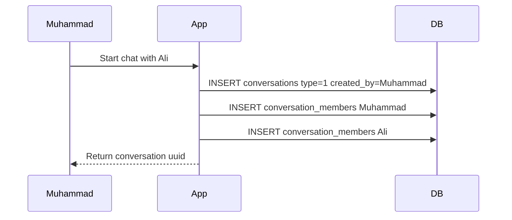

## Flow: create a group

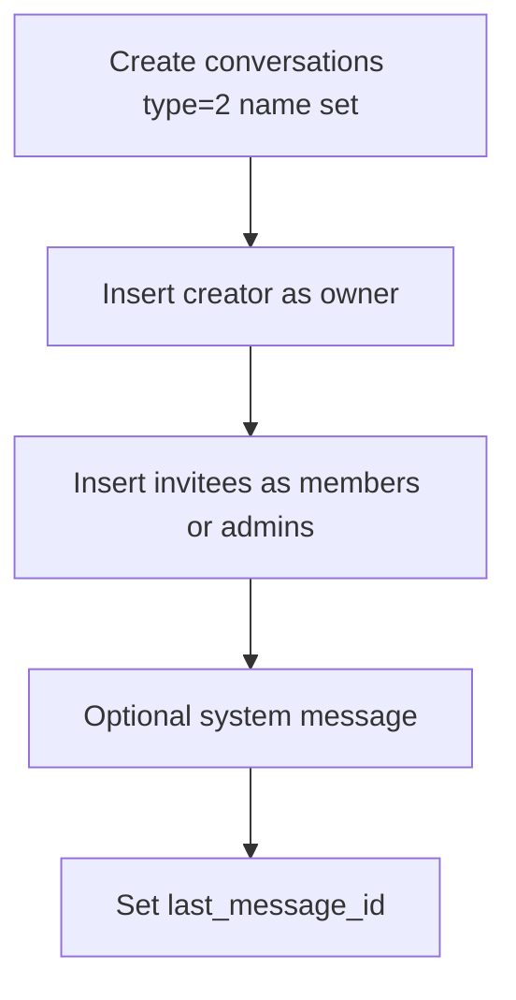

## Flow: send message with attachment

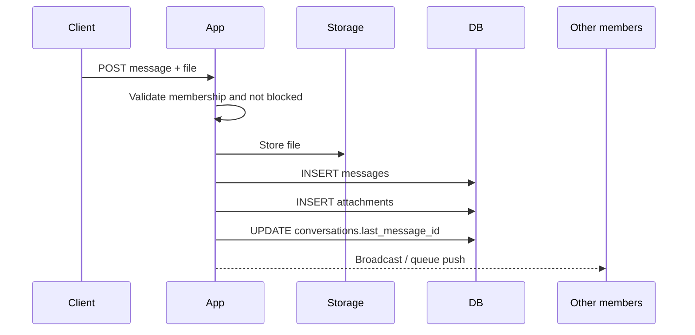

## Flow: delivery then read

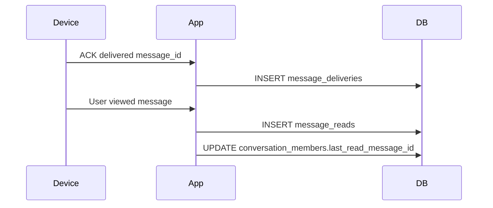

## Flow: react / pin / block / typing

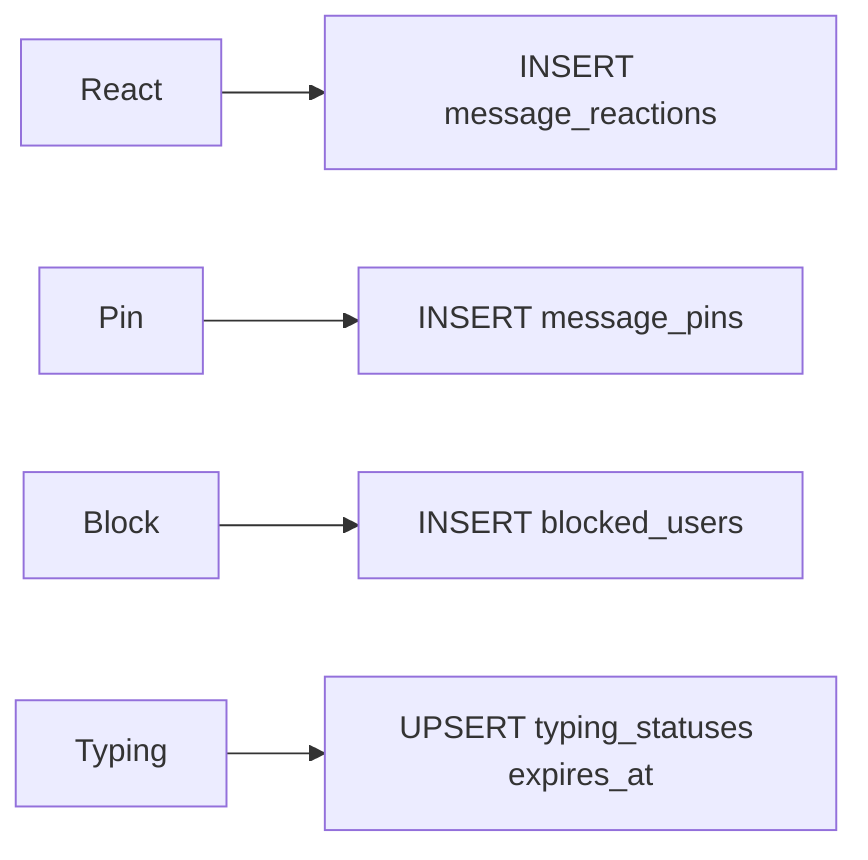

## Flow: device login

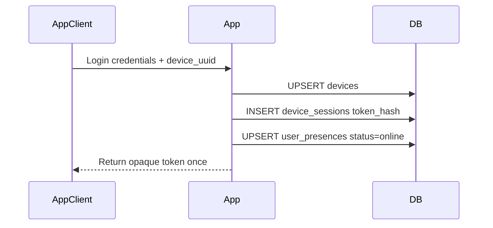

---

# Every Foreign Key

| Table | Foreign Key | References | onDelete | Why Needed |
| ----- | ----------- | ---------- | -------- | ---------- |
| `passkeys` | `user_id` | `users.id` | cascade | Credential belongs to user |
| `conversations` | `created_by` | `users.id` | **restrict** | Keep creator history; block accidental user wipe |
| `conversations` | `last_message_id` | `messages.id` | null | Inbox pointer; clear if message gone |
| `conversation_members` | `conversation_id` | `conversations.id` | cascade | Membership dies with chat |
| `conversation_members` | `user_id` | `users.id` | cascade | Membership dies with user |
| `conversation_members` | `last_read_message_id` | `messages.id` | null | Cursor clears if message gone |
| `messages` | `conversation_id` | `conversations.id` | cascade | Messages belong to chat |
| `messages` | `sender_id` | `users.id` | cascade | Sender must exist |
| `messages` | `parent_message_id` | `messages.id` | null | Thread link |
| `messages` | `reply_to_id` | `messages.id` | null | Reply link |
| `messages` | `forwarded_from_id` | `messages.id` | null | Forward link |
| `attachments` | `message_id` | `messages.id` | cascade | File metadata follows message |
| `message_reads` | `message_id` | `messages.id` | cascade | Receipt follows message |
| `message_reads` | `user_id` | `users.id` | cascade | Receipt follows user |
| `message_deliveries` | `message_id` | `messages.id` | cascade | Same |
| `message_deliveries` | `user_id` | `users.id` | cascade | Same |
| `message_reactions` | `message_id` | `messages.id` | cascade | Reaction follows message |
| `message_reactions` | `user_id` | `users.id` | cascade | Reaction follows user |
| `message_pins` | `conversation_id` | `conversations.id` | cascade | Pin is chat-scoped |
| `message_pins` | `message_id` | `messages.id` | cascade | Pin points at message |
| `message_pins` | `pinned_by` | `users.id` | cascade | Actor must exist |
| `devices` | `user_id` | `users.id` | cascade | Device owned by user |
| `device_sessions` | `device_id` | `devices.id` | cascade | Token belongs to device |
| `user_presences` | `user_id` | `users.id` | cascade | Presence owned by user |
| `user_presences` | `device_id` | `devices.id` | null | Device may vanish |
| `typing_statuses` | `conversation_id` | `conversations.id` | cascade | Typing is chat-scoped |
| `typing_statuses` | `user_id` | `users.id` | cascade | Typing by user |
| `typing_statuses` | `device_id` | `devices.id` | null | Device optional |
| `blocked_users` | `blocker_id` | `users.id` | cascade | Edge endpoint |
| `blocked_users` | `blocked_id` | `users.id` | cascade | Edge endpoint |

**Not FK-constrained:** `sessions.user_id` (Laravel default sessions table).

---

# Every Index

| Table | Index | Why Exists | Performance Benefit |
| ----- | ----- | ---------- | ------------------- |
| `users` | UNIQUE `email` | One account per email | Fast login lookup; integrity |
| `passkeys` | UNIQUE `credential_id` | One credential id globally | Auth lookup |
| `passkeys` | `user_id` | List passkeys | Per-user fetch |
| `sessions` | `user_id`, `last_activity` | Session GC / user sessions | Cleanup and admin |
| `cache` / `cache_locks` | PK `key`; `expiration` | Cache ops + expiry sweep | |
| `jobs` | `queue` | Worker polling | Pop next job |
| `failed_jobs` | UNIQUE `uuid`; `(connection, queue, failed_at)` | Inspect failures | |
| `conversations` | UNIQUE `uuid` | Public routing | API resolve |
| `conversations` | `type`, `created_by`, `last_message_id` | Filters and inbox joins | |
| `conversation_members` | UNIQUE `(conversation_id, user_id)` | One membership | Integrity + join |
| `conversation_members` | `role`, `joined_at` | Role lists / chronology | |
| `conversation_members` | `(user_id, is_archived)` | Inbox archived filter | |
| `conversation_members` | `(conversation_id, last_read_message_id)` | Unread helpers | |
| `messages` | UNIQUE `uuid` | Public routing | |
| `messages` | `(conversation_id, id)` | Thread paging by id | Primary feed path |
| `messages` | `(conversation_id, sent_at)` | Time-ordered feeds | |
| `messages` | `sender_id`, `reply_to_id`, `parent_message_id`, `forwarded_from_id`, `message_type` | Filters and self-joins | |
| `messages` | FULLTEXT `body` (MySQL/MariaDB/PgSQL) | Search | Text search |
| `attachments` | `message_id`, `mime_type`, `storage` | Load files / filter media | |
| `message_reads` | PK `(message_id, user_id)`; `user_id`; `read_at` | Receipt queries | |
| `message_deliveries` | PK `(message_id, user_id)`; `user_id`; `delivered_at` | Receipt queries | |
| `message_reactions` | UNIQUE `(message_id, user_id, emoji)`; singles | No dup reactions; aggregates | |
| `message_pins` | UNIQUE `(conversation_id, message_id)`; `pinned_by`; `pinned_at` | Pin lists | |
| `devices` | UNIQUE `device_uuid`; `platform`; `last_seen_at`; `is_active` | Device identity and filters | |
| `device_sessions` | UNIQUE `token_hash`; `expires_at`; `last_activity_at` | Auth + expiry sweeps | |
| `user_presences` | UNIQUE `user_id`; `status`; `last_seen`; `socket_id` | 1:1 presence + lookups | |
| `typing_statuses` | UNIQUE `(conversation_id, user_id)`; `expires_at` | One typing row; prune | |
| `blocked_users` | UNIQUE `(blocker_id, blocked_id)`; `blocked_id` | Block checks both ways | |

---

# Business Rules

Rules below come from **database constraints** and from **seeders/factories** (application intent). Where only seeders enforce a rule, it is marked **app-level**.

| Question | Answer | Enforced by |
| -------- | ------ | ----------- |
| Can a user join the same conversation twice? | No — one membership row per pair | UNIQUE `(conversation_id, user_id)` |
| Can deleted messages be restored? | Yes, if soft-deleted (`deleted_at` cleared) | SoftDeletes on `messages` |
| Are conversations soft-deleted? | No | Schema |
| Can reactions duplicate? | Same user + same emoji + same message: no | UNIQUE `(message_id, user_id, emoji)` |
| Can attachment exist without message? | No | NOT NULL FK + cascade |
| Can a message have multiple attachments? | Yes | Schema allows; seeders usually create one |
| Must private chats have exactly 2 members? | Intended yes | **App-level** (seeders) |
| Must group creator be owner? | Intended yes | **App-level** (seeders) |
| Channels supported? | Yes in enum/schema | Seeders currently skip channels |
| Read without delivery? | Seeders avoid it; DB allows it | **App-level** preference |
| Dual unread tracking? | Yes — cursor + `message_reads` | Design |
| Who updates `last_message_id`? | Application/seeders; no Observer yet | **App-level** |
| Can user block themselves? | Should not | **App-level** (no DB CHECK) |
| Are blocks symmetric? | No | Schema |
| One presence per user? | Yes | UNIQUE `user_id` |
| Typing duration? | Short-lived (~5s in seeders) | **App-level** TTL |
| Can creator user be hard-deleted? | Not while conversations reference them | `restrictOnDelete` |
| Soft-deleted message remove attachments? | Not automatically | Soft delete ≠ cascade file cleanup |
| Pin message from another chat? | DB allows mismatched ids | **Must validate in app** |
| Device session token storage? | Hash only | Design / seeders |

---

# Database Lifecycle

What happens from registration to account deletion, table by table.

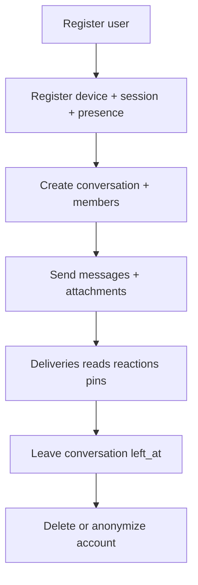

## 1. User registers

* Insert `users`
* Optional: `passkeys`, 2FA columns

## 2. Creates conversation

* Insert `conversations`
* Insert `conversation_members` (creator + others)

## 3. Adds members later

* Insert more `conversation_members` (unique pair)

## 4. Sends messages

* Insert `messages`
* Optional `attachments`
* Update `conversations.last_message_id`

## 5. Edits messages

* Update `messages.body`, set `edited_at`

## 6. Deletes messages

* Soft: set `messages.deleted_at`
* Hard (rare): delete row → attachments/receipts/reactions/pins cascade; `last_message_id` / `last_read_message_id` null

## 7. Leaves conversation

* Set `conversation_members.left_at` (preferred)
* Clear related `typing_statuses`

## 8. Deletes account

Because of FKs, a naive `DELETE FROM users` will:

* Cascade: memberships, messages (as sender), devices (+ sessions), presence, typing, blocks, reactions, reads, deliveries, pins (`pinned_by`), passkeys
* **Fail** if the user still appears in `conversations.created_by` (restrict)

Practical approach:

1. Reassign or soft-retire created conversations
2. Then delete or anonymize the user
3. Clean web `sessions` rows manually (no FK)

---

# Laravel Models and Eloquent

## Model map

| Model | Table | Notes |
| ----- | ----- | ----- |
| `User` | `users` | Authenticatable + Fortify traits |
| `Conversation` | `conversations` | `HasUuids` on `uuid`; route key `uuid` |
| `ConversationMember` | `conversation_members` | Membership entity |
| `Message` | `messages` | SoftDeletes + HasUuids |
| `Attachment` | `attachments` | Storage helpers |
| `MessageRead` | `message_reads` | No incrementing PK |
| `MessageDelivery` | `message_deliveries` | No incrementing PK |
| `MessageReaction` | `message_reactions` | `UPDATED_AT = null` |
| `MessagePin` | `message_pins` | |
| `Device` | `devices` | HasUuids on `device_uuid` |
| `DeviceSession` | `device_sessions` | Explicit `$table` |
| `UserPresence` | `user_presences` | 1:1 user |
| `TypingStatus` | `typing_statuses` | Ephemeral |
| `BlockedUser` | `blocked_users` | |

No custom Observers, Services, or Repositories exist yet for messaging.

## Key relationship declarations

```php
// User
$user->memberships();          // hasMany ConversationMember
$user->sentMessages();         // hasMany Message (sender_id)
$user->createdConversations(); // hasMany Conversation (created_by)
$user->devices();              // hasMany Device
$user->presence();             // hasOne UserPresence
$user->blockedUsers();         // hasMany BlockedUser (blocker_id)
$user->blockedBy();            // hasMany BlockedUser (blocked_id)

// Conversation
$conversation->creator();      // belongsTo User (created_by)
$conversation->members();      // hasMany ConversationMember
$conversation->messages();     // hasMany Message
$conversation->lastMessage();  // belongsTo Message (last_message_id)
$conversation->pins();         // hasMany MessagePin

// Message
$message->conversation();
$message->sender();
$message->parentMessage();
$message->replyTo();
$message->forwardedFrom();
$message->attachments();
$message->reads();
$message->deliveries();
$message->reactions();
$message->pins();
```

### When SQL executes

```php
$message = Message::find(500);     // SELECT messages ...
$message->sender;                  // SELECT users ... WHERE id = sender_id
$message->load('attachments');     // SELECT attachments WHERE message_id IN (...)
```

### Known model gaps (document, not bugs to "fix" here)

* `User::conversations()` deprecated alias of memberships
* No `User::belongsToMany(Conversation::class)` helper
* No Message inverse `hasMany` for replies/children/forwards
* No `User::messagePins()` inverse
* Composite PK models: avoid `find()` / mass `update` without keys

## Casts / enums

| Column | Cast / Enum |
| ------ | ----------- |
| `conversations.type` | `ConversationType` (int) |
| `messages.message_type` | `MessageType` (int) |
| `conversation_members.role` | `MemberRole` (string) |
| `devices.platform` | `DevicePlatform` (string) |
| `user_presences.status` | `PresenceStatus` (string) |
| `attachments.storage` | `AttachmentStorage` (string) |
| `messages.metadata` | `array` |
| passwords / dates | `hashed` / `datetime` as defined on models |

---

# Sample Records

Connected mini-dataset for mental simulation.

## users

| id | name | email |
| -- | ---- | ----- |
| 1 | Muhammad | muhammad@example.com |
| 2 | Ali | ali@example.com |
| 3 | Sara | sara@example.com |

## conversations

| id | uuid | type | created_by | name | last_message_id |
| -- | ---- | ---- | ---------- | ---- | --------------- |
| 10 | uuid-10 | 1 (private) | 1 | null | 502 |
| 20 | uuid-20 | 2 (group) | 1 | Family | 601 |

## conversation_members

| id | conversation_id | user_id | role | left_at | last_read_message_id | is_muted | is_archived |
| -- | --------------- | ------- | ---- | ------- | -------------------- | -------- | ----------- |
| 1 | 10 | 1 | member | null | 502 | 0 | 0 |
| 2 | 10 | 2 | member | null | 501 | 0 | 0 |
| 3 | 20 | 1 | owner | null | 601 | 0 | 0 |
| 4 | 20 | 2 | member | null | 600 | 0 | 0 |
| 5 | 20 | 3 | admin | null | 601 | 0 | 0 |

## messages

| id | conversation_id | sender_id | reply_to_id | body | message_type | deleted_at |
| -- | --------------- | --------- | ----------- | ---- | ------------ | ---------- |
| 500 | 10 | 1 | null | Salam | 0 | null |
| 501 | 10 | 2 | 500 | Wa alaikum | 0 | null |
| 502 | 10 | 1 | null | How are you? | 0 | null |
| 600 | 20 | 1 | null | Welcome to Family | 6 | null |
| 601 | 20 | 3 | null | (image) | 1 | null |

## attachments

| id | message_id | storage | path | mime_type | size |
| -- | ---------- | ------- | ---- | --------- | ---- |
| 1 | 601 | local | uploads/messages/2026/07/pic.jpg | image/jpeg | 204800 |

## message_deliveries / message_reads

| message_id | user_id | delivered_at |
| ---------- | ------- | ------------ |
| 500 | 2 | 12:00:02 |
| 501 | 1 | 12:00:20 |
| 502 | 2 | 12:01:00 |

| message_id | user_id | read_at |
| ---------- | ------- | ------- |
| 500 | 2 | 12:00:10 |
| 501 | 1 | 12:00:25 |

Ali has not read 502 yet → unread for Ali; membership cursor still 501.

## message_reactions

| id | message_id | user_id | emoji |
| -- | ---------- | ------- | ----- |
| 1 | 500 | 2 | 👍 |

## message_pins

| id | conversation_id | message_id | pinned_by |
| -- | --------------- | ---------- | --------- |
| 1 | 20 | 600 | 1 |

## devices / device_sessions / presence

| id | user_id | platform | device_name | is_active |
| -- | ------- | -------- | ----------- | --------- |
| 4 | 1 | android | Muhammad Phone | 1 |

| id | device_id | token_hash | expires_at | revoked_at |
| -- | --------- | ---------- | ---------- | ---------- |
| 9 | 4 | abcd... | +30d | null |

| user_id | device_id | status | socket_id |
| ------- | --------- | ------ | --------- |
| 1 | 4 | online | sock_1 |
| 2 | null | offline | null |

## blocked_users

| blocker_id | blocked_id |
| ---------- | ---------- |
| 1 | 99 |

How they connect: conversation 10 links users 1 and 2; messages 500–502 hang off conversation 10; attachment 1 hangs off message 601 in the group; Ali's unread is visible by comparing `last_read_message_id` to `last_message_id`.

---

# Enums Reference

## ConversationType (int)

| Case | Value | Label |
| ---- | ----- | ----- |
| Private | 1 | private |
| Group | 2 | group |
| Channel | 3 | channel |

## MessageType (int)

| Case | Value | Label | Typically has attachment |
| ---- | ----- | ----- | ------------------------ |
| Text | 0 | text | No |
| Image | 1 | image | Yes |
| Video | 2 | video | Yes |
| Audio | 3 | audio | Yes |
| File | 4 | file | Yes |
| VoiceNote | 5 | voice_note | Yes |
| System | 6 | system | No |
| Gif | 7 | gif | Yes |

## MemberRole (string)

| Case | Value | Privileged (`isPrivileged`) |
| ---- | ----- | --------------------------- |
| Owner | owner | Yes |
| Admin | admin | Yes |
| Moderator | moderator | No |
| Member | member | No |

## DevicePlatform (string)

`android`, `ios`, `web`, `windows`, `macos`, `linux` — `isMobile()` = android|ios.

## PresenceStatus (string)

`online`, `offline`, `away`, `busy`.

## AttachmentStorage (string)

`local`, `s3`, `minio`.

---

# Final Checklist (maintainer)

When changing the schema, update this document if any item changes:

* [ ] Every table still documented
* [ ] Every column explained
* [ ] Every relationship explained
* [ ] Every foreign key listed
* [ ] Every index listed
* [ ] Model relationships match migrations
* [ ] Examples still use real column names
* [ ] Mermaid diagrams still match the real database

This file is the official database reference for the Messenger project.
